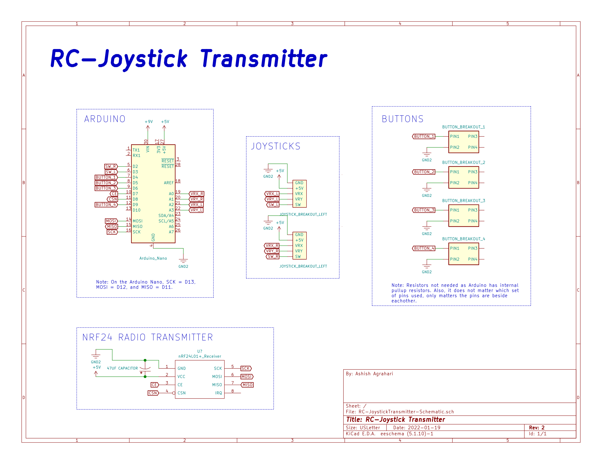
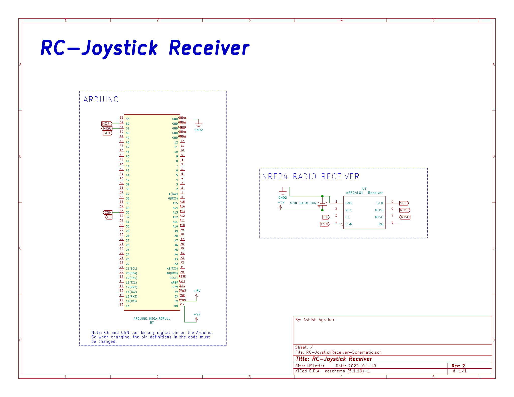
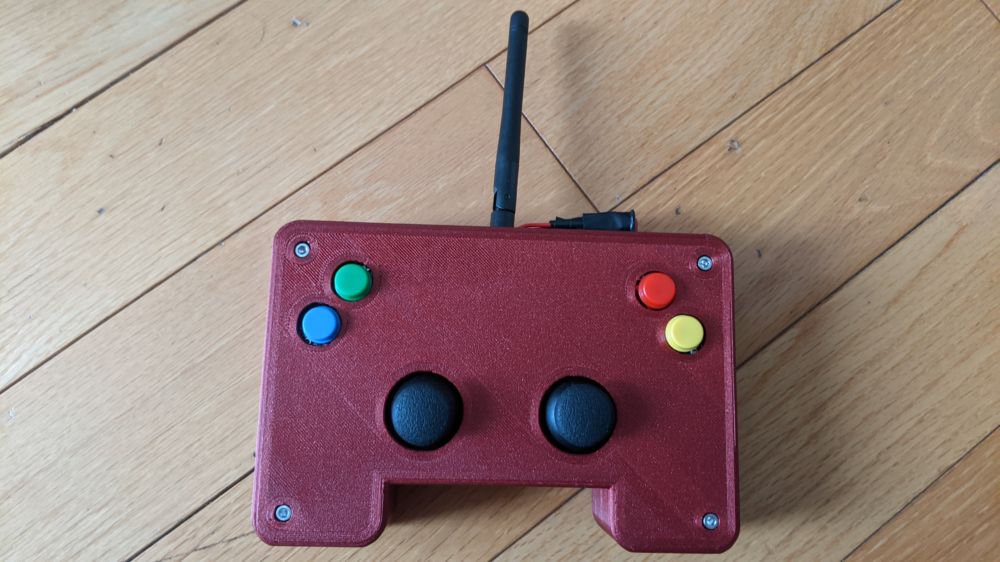
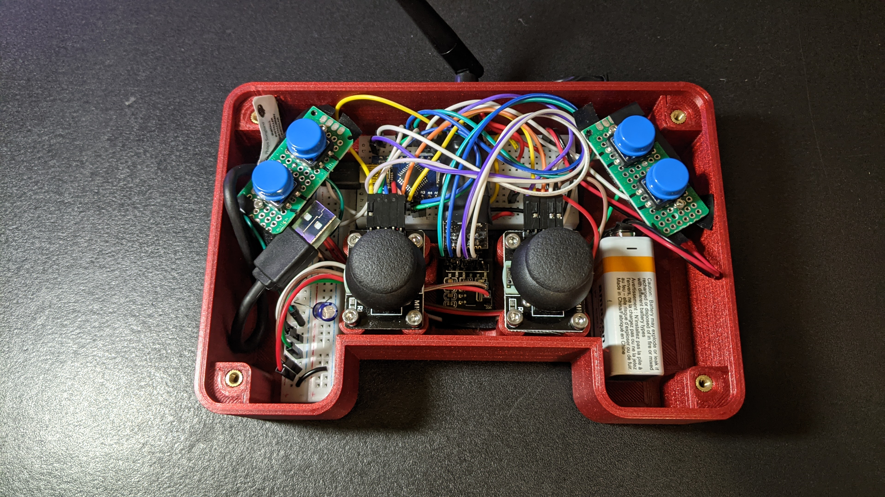
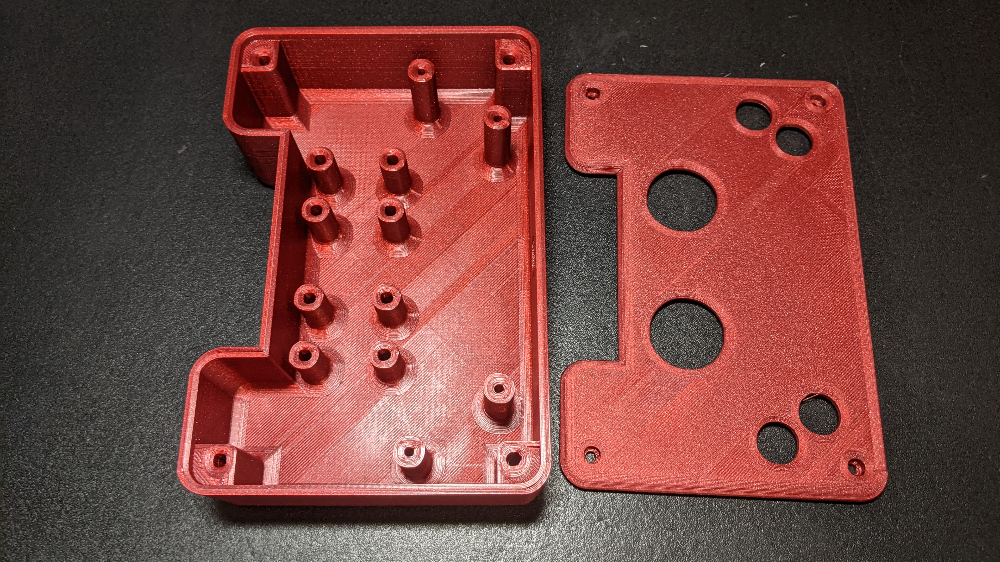
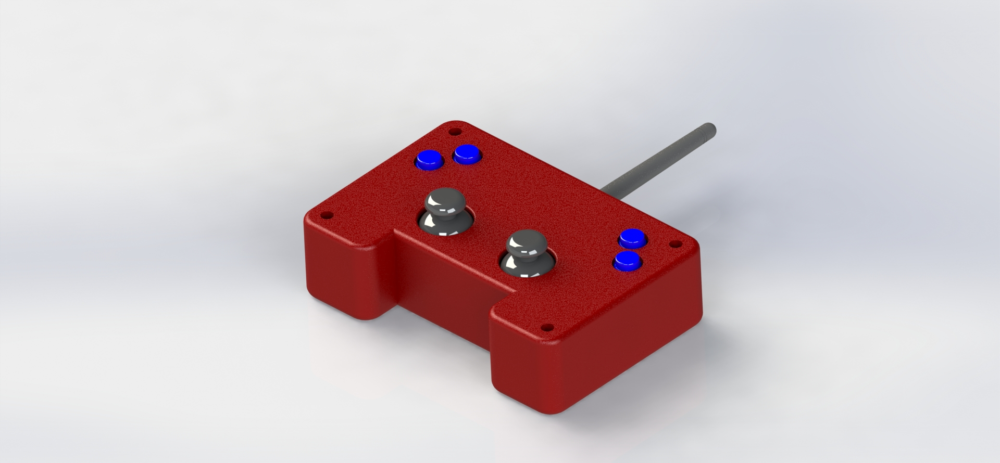
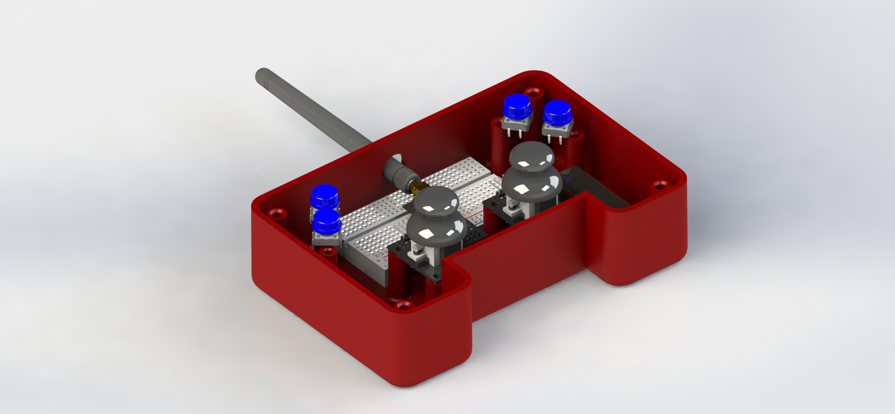

# RC-Joystick
A custom designed joystick which transmits data using an nRF24L01 module.
Programmed in `Platform IO`, models created in `Solidworks`, schematics created in `KiCad`.

## Instructions
- Upload the RC-Joystick-Transmitter.ino in the `RC-Joystick-Transmitter` folder to the joystick transmitter
- Upload the RC-Joystick-Reciever.ino in the `RC-Joystick-Receiver` folder to the joystick receiver

## Schematics
Note: An Arduino Nano (transmitter) and Mega (receiver) are used in these schematics, but any Arduino with the pins required to work with the nRF24L01 module would also work, just remember to change the pin definitions in the code.

Schematic for the RC-Joystick Transmitter:

Schematic for the RC-Joystick Revceiver:

## Images

The final built Joystick using 3D printed parts and other components:

All the wiring and components inside the Joystick:

The 3D printed parts by itself:

Rendered pictures of the 3D model I created using parts from [GrabCAD](https://grabcad.com/library) combined with my own models designed for 3D printing. Made in real-world scale and was made using `Solidworks`.

